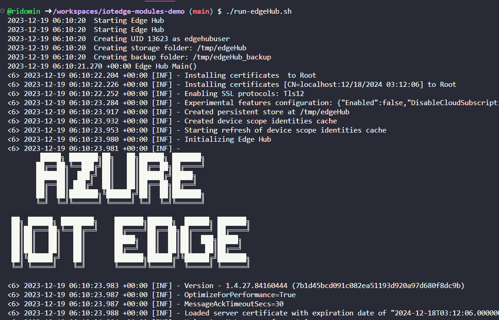

Azure IoT Hub includes support for IoT Edge, a runtime to run custom workload as Modules.

There has been different tools to help with this task, extensions for Visual Studio, [Visual Studio Code](https://learn.microsoft.com/en-us/azure/iot-edge/debug-module-vs-code?view=iotedge-1.4&tabs=c&pivots=iotedge-dev-ext) and even a [CLI](https://learn.microsoft.com/en-us/azure/iot-edge/debug-module-vs-code?view=iotedge-1.4&tabs=c&pivots=iotedge-dev-cli) can help with the most common developer tasks. 

However, most of these tools are in _maintenance_ mode, with no major investments.

# An alternative approach to develop IoTEdge modules

A module is just an application, running as a docker container, that communicates with the a system module called $edgeHub via HTTP, AMQP or MQTT protocols. To develop a module we need a local instance of $edgeHub that we can target from the machine we use to develop.

In this post, I'm exploring a different approach to configure your workstation so you can develop and debug modules with your favourite IDE.

> Note, this sample is using dotnet, but the same concepts should be applicable in other languages.

# How to run $edgeHub locally

$edge hub is available as a docker image in `mcr.microsoft.com/azureiotedge-hub:1.4`, and we need to perform some pre-liminary tasks before running locally: 

- Initialize the $edgeHub  identity in Azure IoT Hub
- Configure $edgeHub module twin
- Provide certificates to configure the TLS connection

## Provisioning $edgeHub

When you create an IoT Edge device identity in Azuere IoT Hub, it will include the module identities for $edgeAgent and $edgeHub system modules. However, the modules are not _initialized_ and do not include the connection string we will need to configure our local instance of $edgeHub. 

In a _real_ environment, this iotedge runtime takes care of initializing the system modules, however it implies to connect, at least one time, the iotedge runtime.

Instead, I'm using the dotnet tool [`aziotedge-modinit`](https://www.nuget.org/packages/aziotedge-modinit) to initialize the $edgeHub module, so we can get the connection string.

### .env configuration files

The following `az` scripts require

- The `$HUB_ID` variable, with the name of the Azure IoT Hub
- The `$EDGE_ID` variable, with the name of the IoTEdge device identity
- The `az` extension is configured to use the subscription with access to the Azure IoT Hub

```bash
az account set -s $SUB_ID
$HUB_ID=<hubname>
$EDGE_ID=<edge_device_id>
```

Initialize the $edgeHub module identity:

```bash
source .env
edgeConnStr=$(az iot hub device-identity connection-string show -n $HUB_ID -d $EDGE_ID  -o tsv)
dotnet tool install -g aziotedge-modinit
aziotedge-modinit --moduleId='$edgeHub' --ConnectionStrings:IoTEdge="$edgeConnStr"
```

## Configuring $edgeHub

At startup, $edgeHub requires two properties to be configured in the module twin, however as this is a system module, we cannot update the twin, neither using the portal, or the CLI. 

```json
 "$edgeHub": {
    "properties.desired": {
        "schemaVersion": "1.1",
        "storeAndForwardConfiguration": {
            "timeToLiveSecs": 7200
        },
        "routes": {}
    }
}
```

The only workaround I've found, is to invoke the `SetModules` operation, using a default deployment manifest, which includes the expected Twin Properties.

```bash
source .env
curl https://raw.githubusercontent.com/ridomin/iotedge-modules-demo/main/deployBase.json -o deployBase.json
az iot edge set-modules -n $HUB_ID -d $EDGE_ID -k deployBase.json
```

> Or you can use the portal and follow the SetModules screens with all default values.  

## Certificates for local development with dotnet dev-certs

The system modules expose endpoints protected by a TLS connection, to configure the TLS we need to provide an X509 certificate. This certificate can be the same certificate aspnet uses to provide a local TLS connection.

The next script creates a certificate for localhost and exports the public and private keys as .PEM and .KEY files, then we can use those files to configure the docker instance.

```bash
dotnet dev-certs https -ep _certs/localhost.pem --format PEM --no-password
chmod +r _certs/*
cp _certs/localhost.pem _certs/ca.pem
```

## Running $edgeHub locally with docker

Now that we have the certs, and the $edgeHub connection string, we can run the docker container with:

```bash
source .env
connStr=$(az iot hub module-identity connection-string show -n $HUB_ID -d $EDGE_ID -m '$edgeHub' --query connectionString -o tsv)

docker run -it --rm \
    -e IotHubConnectionString="$connStr" \
    -e EdgeModuleHubServerCertificateFile=/certs/localhost.pem \
    -e EdgeModuleHubServerCAChainCertificateFile=/certs/ca.pem \
    -e EdgeHubDevServerCertificateFile=/certs/localhost.pem \
    -e EdgeHubDevTrustBundleFile=/certs/ca.pem \
    -e EdgeHubDevServerPrivateKeyFile=/certs/localhost.key \
    -v ${pwd}/_certs:/certs \
    -p 8883:8883 \
    mcr.microsoft.com/azureiotedge-hub:1.4
```

If everything goes as expected, you should see this output.



## Create a dotnet Module

Now you can create a dotnet module using the dotnet template, to install it:

```bash
dotnet new install Microsoft.Azure.IoT.Edge.Module
```

To create a new project based on this template

```bash
MODULE_ID=MyModule
dotnet new aziotedgemodule -o $MODULE_ID
```

## Provision the Module Identity

```bash
source ../.env
az iot hub module-identity create -n $HUB_ID -d $EDGE_ID -m $MODULE_ID
modcs=$(az iot hub module-identity connection-string show -n $HUB_ID -d $EDGE_ID -m ModuleA -o tsv)
```

# Run Debug the custom module

Finally, you can run or debug this project by tweaking the configuration so it will connect to the local $edgeHub instance, using the certificate configured for TLS:

```bash
export IotHubConnectionString="$modcs;GatewayHostName=localhost"
export EdgeModuleCACertificateFile="../_certs/ca.pem"
dotnet run
```

The complete sample is available in [https://github.com/ridomin/iotedge-modules-demo](https://github.com/ridomin/iotedge-modules-demo) (CodeSpaces ready)